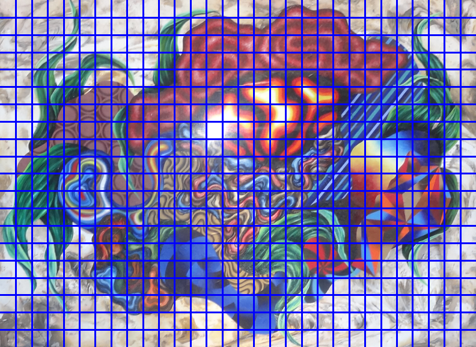
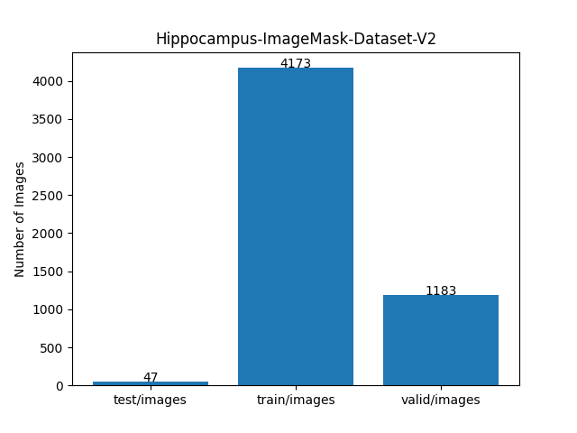
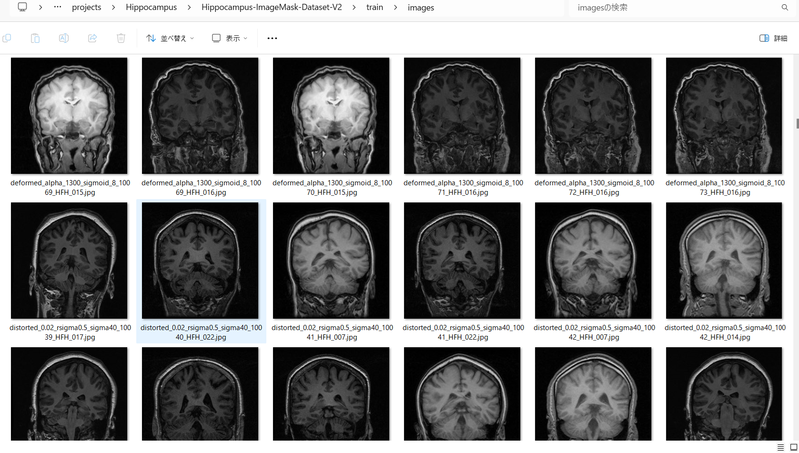
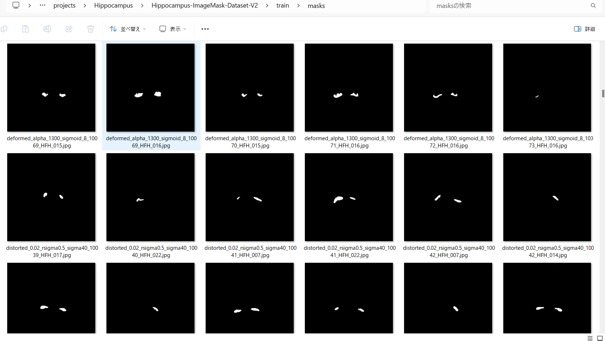
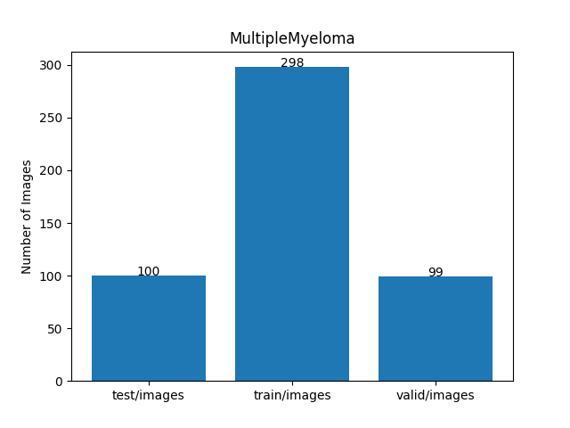
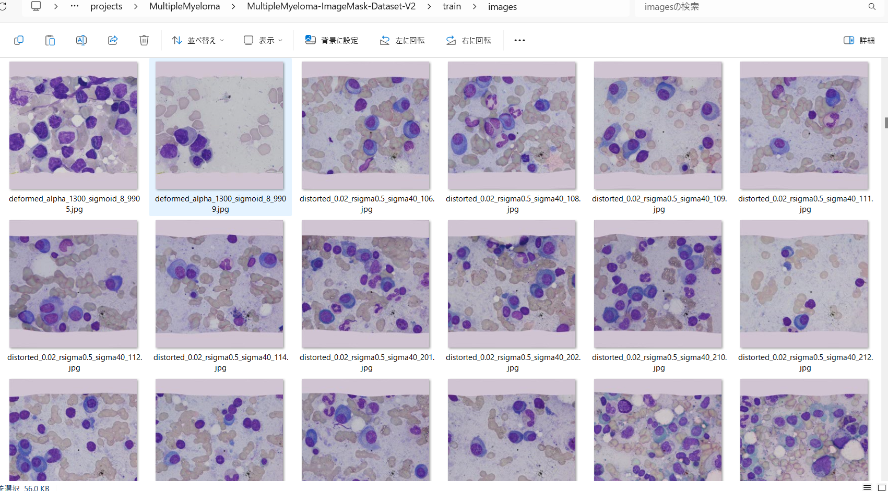
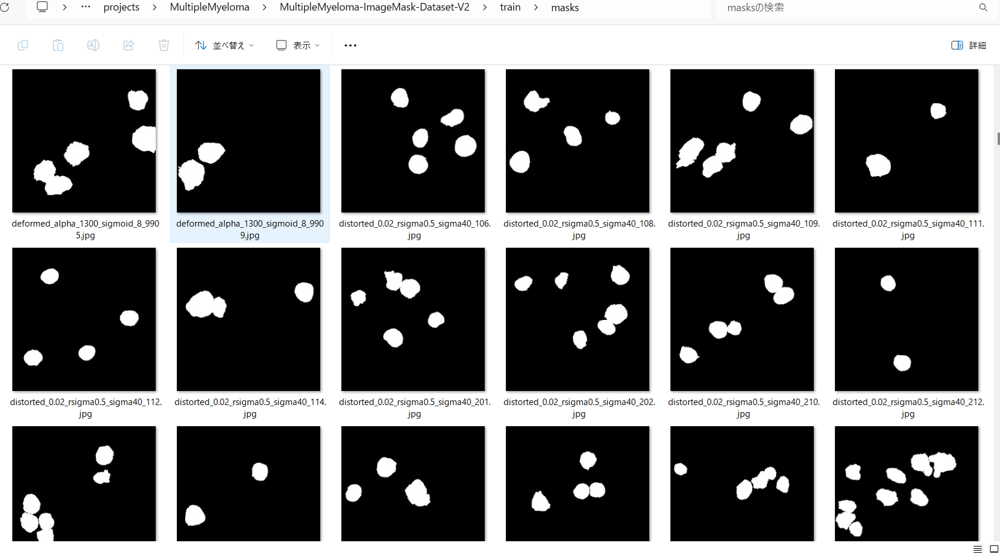

<h2> ImageMask-Dataset-Offline-Augmentation-Tool (2024/05/08)</h2>
This is a simple ImageMask Dataset Offline Augmentation Tool for Image Segmentation. 
In situations where the Python library you are using to train a segmentation model online with your dataset 
lacks deformation or distortion augmentation methods, this offline dataset augmentation tool can lead to the development 
of a more refined model. 
 
<a href="#1">1. OfflineImageMaskAugmentor</a> 
<a href="#1.1">1.1 Image Deformation</a> 
<a href="#1.2">1.2 Image Distortion</a> 

<a href="#2">2. Projects</a> 
<a href="#2.1">2.1 Hippocampus</a> 
<a href="#2.2">2.2 MultipleMyeloma</a> 
<a href="#3">3. Dataset Citation</a> 
<a href="#3.1">3.1 Hippocampus</a> 
<a href="#3.2">3.2 MultipleMyeloma</a> 

 
<h3> 
<a id="1">1. OfflineImageMaskAugmentor</a>
</h3>

This is a simple python class <a href="./src/OfflineImageMaskAugmentor.py">OfflineImageMaskAugmentor</a> to augment ImageMask-Dataset for 
Image Segmentation, which is an offline version of <a href="https://github.com/sarah-antillia/Tensorflow-Image-Segmentation-API/blob/main/src/ImageMaskAugmentor.py">ImageMaskAugmentor.py</a> in Tensorflow-Image-Segmenation-API. 

This tool supports the following image augmentation methods, which are implemented by Python OpenCV and scipy libraries. 
<li>flip</li>  
<li>rotation</li>  
<li>shear</li>
<li>shrink</li>
<li>deformation</li>
<li>distortion</li>
   
In general, the deformation and distortion image transformation will take a slightly long time, so this type of offline 
augmentation tool may be a useful for creating an augmented dataset for Image Segmentation.  
 

Youn can run the OffilneImageMaskAugmentor.py script with a <a href="./projects/Hippocampus/generator.config">generator.config</a> file 
in the following way, 
<pre> 
>python OffilneImageMaskAugmentor generator.config
</pre>

In OffilneImageMaskAugmentor class, we used the Python scripts in following deformation and distortion tool
to deform and distort images and mask files. 
 
<h3> 
<a id="1.1">1.1 Image Deformation</a>
</h3>
We used <a href="https://github.com/sarah-antillia/Image-Deformation-Tool">Image-Deformation-Tool</a> to implement the 
deformation method in OffilneImageMaskAugmentor.  
<b>Deformation example</b> 
<table>
<tr>
<th>Before
</th>
<th>After
</th>
</tr>
<tr>
<td>

</td>

<td>

</td>
</tr>
</table>
 
<h3> 
<a id="1.2">1.2 Image Distortion</a>
</h3>
We used <a href="https://github.com/sarah-antillia/Image-Distortion-Tool">Image-Distortion-Tool</a> to implement the 
distortion method in OffilneImageMaskAugmentor.  
<b>Distortion example</b> 
<table>
<tr>
<th>Before
</th>
<th>After
</th>
</tr>
<tr>
<td>

</td>

<td>

</td>
</tr>
</table>

 

<h3> 
<a id="2">2. Projects</a>
</h3>

<h3> 
<a id="2.1">2.1 Hippocampus</a>
</h3>
This is a simple sample project to apply the Offline Augmentation Tool to Hippocampus dataset. 
Please move to "./projects/Hippocampus" directory, and run the following bat file. 
<pre>
> 1.augment.bat,
</pre>
,which simply runs Python script OfflineImageMaskAugmentor.py with a <a href="./projects/Hippocampus/generator.config">
generator.config</a> in the following way. 
<pre>
python ../../src/OffilneImageMaskAugmentor.py ./generator.config
</pre>

, where generator,config is a simple configuration file seperated by sections and parameters. 
<pre>
[dataset]
; generator.config
; 2024/05/10 (C) antillia.com

image_width  = 512
image_height = 512
;image_channel = 3
dataset_dir     = "./Hippocampus"
augmented_dir   = "./Hippocampus-ImageMask-Dataset-V2"
no_augmentation = "test"

[augmentor]
hflip     = True
vflip     = False
rotation  = True
shrinks   = [0.8, 0.9]
angles    = [5, 10, 350, 355]
shears    = [0.2]

deformation = True
distortion  = True

[deformation]
alpah   = 1300
sigmoid = 8
 
[distortion]
gaussian_filter_rsigma = 40
gaussian_filter_sigma  = 0.5
distortions            = [0.02, 0.03]
</pre>

For <b>dataset_dir</b> parameter in [generator] section, 
please specify a base dataset directory which you would like to augment,
<pre>
[generator]
dataset_dir     = "./Hippocampus"
</pre>
In this case, <b>./Hippocampus</b>  has the following folder structure. 
<pre>
./Hippocampus
├─test
│  ├─images
│  └─masks
├─train
│  ├─images
│  └─masks
└─valid
    ├─images
    └─masks
</pre>

This is taken from the github repository <a href="https://github.com/atlan-antillia/Hippocampus-Image-Dataset">Hippocampus-Image-Dataset</a>
 
<b>Hippocampus_Statistics</b> 
 

By running the bat file above, new Augmented Dataset in directory by sepecified by <b>augemented_dir</b> parameter
will be created. 

<pre>
./Hippocampus-ImageMask-Dataset-V2
├─test
│  ├─images
│  └─masks
├─train
│  ├─images
│  └─masks
└─valid
    ├─images
    └─masks
</pre>

<b>Hippocampus-ImageMask-Dataset-V2_Statistics</b> 
 

<b>Augmented train-images-sample</b> 
 

<b>Augmented mask-images-sample</b> 
 

<h3> 
<a id="2.2">2.2 MultipleMyeloma</a>
</h3>
This is a simple sample project to apply the Offline Augmentation Tool to MultipleMyeloma dataset. 
Please move to "./projects/MultipleMyeloma" directory, and run the following bat file. 
<pre>
> 1.augment.bat,
</pre>
,which simply runs Python script OfflineImageMaskAugmentor.py with a <a href="./projects/MultipleMyeloma/generator.config">
generator.config</a> in the following way. 
<pre>
python ../../src/OffilneImageMaskAugmentor.py ./generator.config
</pre>

, where generator,config is a simple configuration file seperated by sections and parameters. 
<pre>
; generator.config
; 2024/05/10 (C) antillia.com

[dataset]
image_width  = 512
image_height = 512
;image_channel = 3
dataset_dir     = "./MultipleMyeloma"
augmented_dir   = "./MultipleMyeloma-ImageMask-Dataset-V2"
no_augmentation = "test"

[augmentor]
rotation  = True
shrinks   = [0.8]
angles    = [60,120,180,240,300]
shears    = [0.2]
hflip     = True
vflip     = True

deformation = True
distortion  = True

[deformation]
alpah   = 1300
sigmoid = 8
 
[distortion]
gaussian_filter_rsigma = 40
gaussian_filter_sigma  = 0.5
distortions            = [0.02, 0.03]
</pre>
For <b>dataset_dir</b> parameter in [generator] section, 
please specify a base dataset directory which you would like to augment,
<pre>
[generator]
dataset_dir     = "./MultipleMyeloma"
</pre>
In this case, <b>./MultipleMyeloma</b>  has the following folder structure. 
<pre>
./MultipleMyeloma
├─test
│  ├─images
│  └─masks
├─train
│  ├─images
│  └─masks
└─valid
    ├─images
    └─masks
</pre>

This is taken from the github repository <a href="https://github.com/sarah-antillia/Tensorflow-Image-Segmentation-Dataset/tree/main/dataset/MultipleMyeloma">MultipleMyelomat</a>
 

<b>MultipleMyeloma_Statistics</b> 
 

By running the bat file above, new Augmented Dataset in directory by sepecified by <b>augemented_dir</b> parameter
will be created. 

<pre>
./MultipleMyeloma-ImageMask-Dataset-V2
├─test
│  ├─images
│  └─masks
├─train
│  ├─images
│  └─masks
└─valid
    ├─images
    └─masks
</pre>

<b>MultipleMyeloma-ImageMask-Dataset-V2_Statistics</b> 
 

<b>Augmented train-images-sample</b> 
 

<b>Augmented mask-images-sample</b> 
 

 
<h3> 
<a id="3">3. Dataset Citations</a>
</h3>
<h3> 
<a id="3.1">3.1 Hippocampus</a>
</h3>
The image dataset used here has been taken from the following kaggle web site. 
<a href="https://www.kaggle.com/datasets/andrewmvd/hippocampus-segmentation-in-mri-images">
Hippocampus Segmentation in MRI Images</a> 

<pre>
<b>About Dataset</b>

Introduction
The hippocampus is a structure within the brain that plays important roles in the 
consolidation of information from short-term memory to long-term memory, and in spatial 
memory that enables navigation. 
Magnetic resonance imaging is often the optimal modality for brain medical imaging studies, 
being T1 ideal for representing structure.
The hippocampus has become the focus of research in several neurodegenerative disorders. 
Automatic segmentation of this structure from magnetic resonance (MR) imaging scans of the 
brain facilitates this work, especially in resource poor environments.
 
<b>About This Dataset</b>

This dataset contains T1-weighted MR images of 50 subjects, 40 of whom are patients with 
temporal lobe epilepsy and 10 are nonepileptic subjects. Hippocampus labels are provided 
for 25 subjects for training. For more information about the dataset, refer to the 
original article.

How To Cite this Dataset
Original Article
K. Jafari-Khouzani, K. Elisevich, S. Patel, and H. Soltanian-Zadeh, 
“Dataset of magnetic resonance images of nonepileptic subjects and temporal lobe epilepsy 
patients for validation of hippocampal segmentation techniques,” 
Neuroinformatics, 2011.

License
The dataset is free to use for research and education. 
Please refer to the original article if you use it in your publications.

Dataset BibTeX
@article{,
title= {MRI Dataset for Hippocampus Segmentation (HFH) (hippseg_2011)},
keywords= {},
author= {K. Jafari-Khouzani and K. Elisevich, S. Patel and H. Soltanian-Zadeh},
abstract= {This dataset contains T1-weighted MR images of 50 subjects, 40 of whom are patients
with temporal lobe epilepsy and 10 are nonepileptic subjects. Hippocampus labels are provided 
for 25 subjects for training. The users may submit their segmentation outcomes for the 
remaining 25 testing images to get a table of segmentation metrics.},
terms= {The dataset is free to use for research and education. Please refer to the following 
article if you use it in your publications:
K. Jafari-Khouzani, K. Elisevich, S. Patel, and H. Soltanian-Zadeh, 
“Dataset of magnetic resonance images of nonepileptic subjects and temporal lobe epilepsy 
patients for validation of hippocampal segmentation techniques,” Neuroinformatics, 2011.},
license= {free to use for research and education},
superseded= {},
url= {https://www.nitrc.org/projects/hippseg_2011/}
}
</pre>

<h3> 
<a id="3.2">3.2 MultipleMyeloma</a>
</h3>
The original dataset used here has been take from the following  web site:  
<b>SegPC-2021-dataset</b> 
SegPC-2021: Segmentation of Multiple Myeloma Plasma Cells in Microscopic Images 
<pre>
https://www.kaggle.com/datasets/sbilab/segpc2021dataset
</pre>
Citation: 
<pre>
Anubha Gupta, Ritu Gupta, Shiv Gehlot, Shubham Goswami, April 29, 2021, "SegPC-2021: Segmentation of Multiple Myeloma Plasma Cells 
in Microscopic Images", IEEE Dataport, doi: https://dx.doi.org/10.21227/7np1-2q42.
BibTex
@data{segpc2021,
doi = {10.21227/7np1-2q42},
url = {https://dx.doi.org/10.21227/7np1-2q42},
author = {Anubha Gupta; Ritu Gupta; Shiv Gehlot; Shubham Goswami },
publisher = {IEEE Dataport},
title = {SegPC-2021: Segmentation of Multiple Myeloma Plasma Cells in Microscopic Images},
year = {2021} }
IMPORTANT:
If you use this dataset, please cite below publications-
1. Anubha Gupta, Rahul Duggal, Shiv Gehlot, Ritu Gupta, Anvit Mangal, Lalit Kumar, Nisarg Thakkar, and Devprakash Satpathy, 
 "GCTI-SN: Geometry-Inspired Chemical and Tissue Invariant Stain Normalization of Microscopic Medical Images," 
 Medical Image Analysis, vol. 65, Oct 2020. DOI: 
 (2020 IF: 11.148)
2. Shiv Gehlot, Anubha Gupta and Ritu Gupta, 
 "EDNFC-Net: Convolutional Neural Network with Nested Feature Concatenation for Nuclei-Instance Segmentation,"
 ICASSP 2020 - 2020 IEEE International Conference on Acoustics, Speech and Signal Processing (ICASSP), 
 Barcelona, Spain, 2020, pp. 1389-1393.
3. Anubha Gupta, Pramit Mallick, Ojaswa Sharma, Ritu Gupta, and Rahul Duggal, 
 "PCSeg: Color model driven probabilistic multiphase level set based tool for plasma cell segmentation in multiple myeloma," 
 PLoS ONE 13(12): e0207908, Dec 2018. DOI: 10.1371/journal.pone.0207908
License
CC BY-NC-SA 4.0
</pre>

